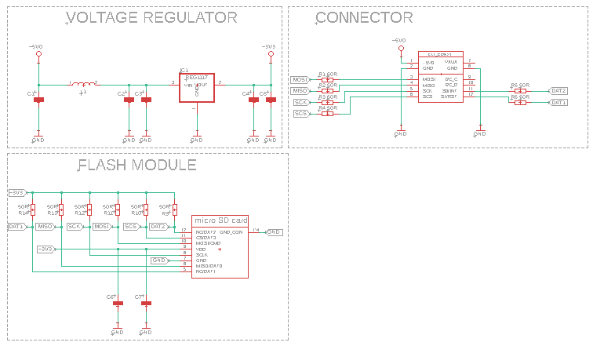
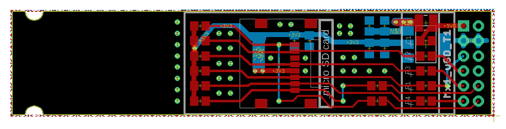

# Expansion Module: MicroSD Card Slot

## Overview
The *Expansion Module: MicroSD Card Slot* is designed for interfacing with FPGA on the SmartBoard platform. It provides a slot for a microSD card, enabling the module to facilitate easy data storage and retrieval. This module is an excellent tool for learning about and experimenting with microSD interfacing.

### Key Features
- MicroSD card slot for simple and efficient data storage.
- Compatible with SmartBoard's single socket interface.
- Ideal for applications and learning experiences in microSD card interfacing.

## Design Files

### Schematic Diagram

### Board Layout

## License
The *Expansion Module: MicroSD Card Slot* project is released under the MIT License, granting permission to use, modify, and distribute this design in both private and commercial settings.

- **Permission to Use**: You are free to use, modify, and distribute this design in both private and commercial settings.
- **Attribution Requirement**: While not required, attribution to the original author, Adam Łuczak, is appreciated. This can be done through a citation or a link back to this repository.
- **No Warranty**: This design is provided "as is", without warranty of any kind. Use it at your own risk.
- **Liability**: The author is not liable for any damages or losses that may arise from the use of this design.

For the full terms and conditions, please refer to the MIT License documentation.

## Contact
For any inquiries or suggestions about the *Expansion Module: MicroSD Card Slot* project, please feel free to contact Adam Łuczak at adam.luczak@outlook.com.
